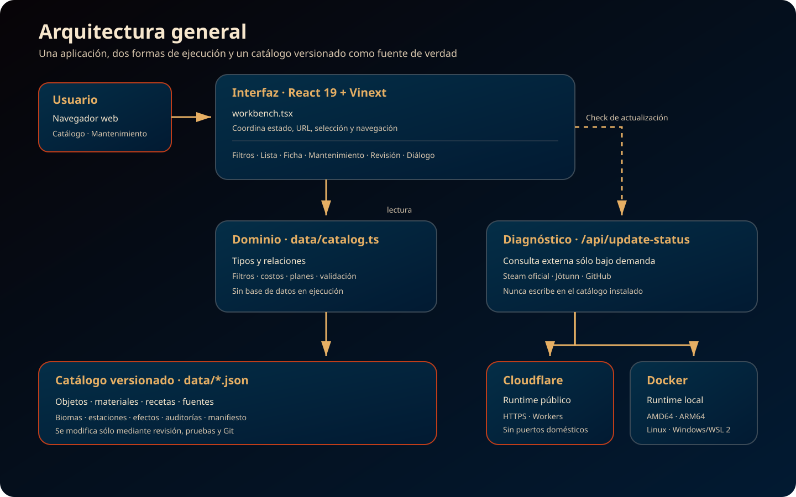

# Valheim Helper

Aplicación de consulta para saber qué se necesita para fabricar y mejorar objetos de Valheim, cuánto hace falta y dónde conseguir cada material. Puede ejecutarse localmente o utilizarse desde su despliegue público en Cloudflare Workers.

## Estado del proyecto

- Versión de la aplicación: `1.2.0`.
- Versión del catálogo de datos: `0.1.25`.
- Versión de referencia de Valheim: `0.221.12`.
- Interfaz en español.
- Nombres de entidades en español e inglés.
- Catálogo funcional de los biomas jugables actuales, con equipo, estaciones, comida, transporte y construcciones no decorativas.
- Despliegue público: <https://valheim-helper.roariel.workers.dev>.
- Ejecución local con pnpm o Docker como alternativas de desarrollo y operación doméstica.
- pnpm como único gestor de paquetes.

## Funcionalidades actuales

- Búsqueda de objetos por nombre en español o inglés y por categoría.
- Navegación persistente en la URL para recargar, volver atrás o compartir una consulta sin perder sus filtros y objeto seleccionado.
- Filtros por categoría.
- Resumen de filtros activos, eliminación individual y limpieza directa del campo de búsqueda.
- Limpieza progresiva con `Esc` en computadora: búsqueda primero y filtros restantes después.
- Identidad visual por bioma en tarjetas y panel de detalle.
- Planificador de objetivo con nivel seleccionable, materias primas acumuladas, estaciones y biomas de recolección.
- Navegación entre objetos base, variantes y extensiones directamente desde sus fichas.
- Mesa de trabajo con progresión por bioma, catálogo compacto y subfiltros contextuales de armas y comida.
- Receta de fabricación inicial.
- Cantidad producida por lote para flechas, consumibles y demás recetas múltiples.
- Propiedades completas de comida: salud, aguante, eitr, curación, duración y efectos.
- Resumen de salud, aguante, eitr y duración en las tarjetas de comida.
- Mejoras de armas y herramientas por nivel.
- Costo individual de cada mejora y resumen total desde nivel 1 hasta el nivel máximo.
- Estación y nivel requeridos.
- Extensiones necesarias para elevar bancos de trabajo, forjas y calderos, con su progresión habitual.
- Origen, nombre bilingüe, bioma, requisito y fuentes alternativas de los materiales.
- Detalle desplegable de materiales procesados con estación, tamaño de lote e ingredientes calculados.
- Diseño adaptable a computadora y teléfono.
- Navegación por teclado y anuncios accesibles en pestañas, resultados, selección y diagnóstico de actualizaciones.
- Regreso directo desde la ficha móvil a los resultados del catálogo.
- Diagnóstico de actualizaciones bajo demanda, con comparación de la app, el catálogo y la versión estable de Valheim sin modificar los datos instalados.
- Sección **Mantenimiento** separada del catálogo para diagnóstico y revisión editorial ocasional.

## Recursos visuales

- Los iconos individuales de los objetos usan el sistema visual propio de la aplicación. No se incorporan imágenes de wikis u otras fuentes sin una licencia explícita para su reutilización.

## Arquitectura en una imagen



La estructura del repositorio y el circuito completo de actualización y despliegue se explican visualmente en el [índice de documentación](docs/README.md).

## Entorno local

El proyecto se encuentra en:

```text
~/dev/valheim-helper
```

Requiere Node.js `22.13` o posterior y pnpm `11.16.0`.

```bash
cd ~/dev/valheim-helper
pnpm install
pnpm dev
```

La aplicación queda disponible normalmente en:

```text
http://localhost:3000/
```

Para ejecutar la validación automatizada del catálogo y la compilación:

```bash
pnpm test
pnpm lint
```

Para probar la interfaz en Chromium con los tamaños móvil, escritorio y 2K:

```bash
pnpm test:e2e
```

Las capturas de cada ejecución quedan en `test-results/` y no se versionan. La primera vez también se debe instalar el navegador administrado por Playwright con `pnpm exec playwright install chromium`.

La matriz completa de controles y el alcance congelado de la versión se encuentran en [`docs/release-v1.md`](docs/release-v1.md).

El cierre activo de Aplicación `1.2.0` se encuentra en [`docs/release-v1.2.0.md`](docs/release-v1.2.0.md).

## Ejecutar con Docker

La aplicación incluye una imagen portable para Linux AMD64, Linux ARM64 y Windows mediante WSL 2 o Docker Desktop:

```bash
docker compose up -d --build
```

Queda disponible en `http://localhost:3000`. La instalación, configuración de puerto, actualización, rollback y publicación multiplataforma se documentan en [`docs/despliegue-docker.md`](docs/despliegue-docker.md).

## Publicar en Cloudflare Workers

La misma aplicación puede publicarse en Cloudflare Workers sin abrir puertos ni mantener encendido un servidor doméstico:

```bash
pnpm deploy:cloudflare:check
pnpm deploy:cloudflare
```

El primer comando valida el paquete sin publicarlo. La configuración, autenticación, verificación y operación se documentan en [`docs/despliegue-cloudflare.md`](docs/despliegue-cloudflare.md).

La instancia vigente se encuentra en <https://valheim-helper.roariel.workers.dev>. La publicación continúa siendo manual: un cambio fusionado en GitHub no llega al Worker hasta ejecutar el comando de despliegue desde un checkout actualizado.

## Trabajar con VS Code

Abrir el proyecto directamente desde WSL:

```bash
cd ~/dev/valheim-helper
code .
```

VS Code debe mostrar un entorno similar a `WSL: Ubuntu`. La extensión de Codex también debe estar instalada o habilitada dentro de WSL para trabajar directamente sobre estos archivos.

## Estructura principal

El punto de entrada para toda la documentación es [`docs/README.md`](docs/README.md). Allí se distingue qué documentos describen el estado actual, cuáles son guías operativas y cuáles conservan evidencia histórica.

- `app/workbench.tsx`: coordinación de navegación, filtros y selección del catálogo.
- `app/components/item-detail.tsx`: ficha, mejoras, plan de objetivo y procesos de materiales.
- `app/components/catalog-navigation.tsx`: cabecera, progresión por bioma y lista de resultados.
- `app/components/catalog-filters.tsx`: búsqueda, filtros contextuales, resumen y filtros activos.
- `app/components/maintenance-workspace.tsx`: entrada a diagnóstico y revisión editorial.
- `app/components/review-workspace.tsx`: inventario editorial de candidatos externos.
- `app/components/update-dialog.tsx`: diagnóstico accesible de versiones.
- `data/catalog-filters.ts`: lógica pura de filtrado y resolución de selección.
- `app/globals.css`: diseño visual y adaptación para móvil.
- `app/layout.tsx`: metadatos e idioma de la aplicación.
- `data/manifest.json`: versión de la aplicación, del juego y del conjunto de datos.
- `CHANGELOG.md`: historial de cambios publicados del catálogo y la aplicación.
- `data/items.json`: objetos del catálogo.
- `data/materials.json`: materiales y relación con sus fuentes.
- `data/recipes.json`: fabricación y mejoras por nivel.
- `data/sources.json`: procedencia, biomas y requisitos.
- `data/biomes.json`: biomas en español e inglés.
- `data/subcategories.json`: taxonomía de subcategorías y pertenencia de objetos.
- `data/stations.json`: estaciones en español e inglés.
- `data/catalog.ts`: tipos, relaciones y validación de referencias.
- `data/README.md`: contrato del catálogo y proceso para incorporar datos.
- `docs/actualizacion-de-datos.md`: procedimiento de actualización por versión de Valheim.
- `docs/release-v1.md`: alcance, validación y decisiones de mantenimiento de la V1.
- `docs/release-v1.2.0.md`: alcance y validación operativa de la versión activa.
- `docs/TODO-pruebas.md`: verificaciones manuales aprobadas y pruebas pendientes en monitores reales.
- `docs/stack-tecnologico.md`: definición, justificación y límites del stack tecnológico.
- `docs/despliegue-docker.md`: instalación y operación en Linux, Windows y ARM64.
- `docs/despliegue-cloudflare.md`: publicación y operación en Cloudflare Workers.
- `docs/roadmap-actualizacion.md`: bloques acordados para detectar, revisar y aplicar futuras novedades del juego.
- `docs/images/`: diagramas SVG editables de arquitectura, repositorio y flujo de mantenimiento.

El flujo de mantenimiento puede generar un snapshot externo temporal con `pnpm data:snapshot` y revisarlo con `pnpm data:diff`; ambos son de solo lectura respecto del catálogo productivo.

## Criterios del modelo

- Cada entidad tiene un identificador estable.
- Los nombres de entidades se guardan como `es` y `en`.
- Los textos de la interfaz y las explicaciones se escriben en español.
- Los materiales se definen una sola vez y las recetas los referencian mediante `materialId`.
- La fabricación inicial y cada mejora se almacenan como pasos separados.
- Los datos representan el estado actual del juego; no se mantiene historial de versiones por ahora.
- Un dato dudoso debe quedar pendiente de verificación y nunca completarse por intuición.

## Añadir contenido

1. Añadir el objeto a `data/items.json` con nombres `es` y `en`.
2. Registrar materiales nuevos en `data/materials.json` sin duplicar los existentes.
3. Registrar fuentes nuevas en `data/sources.json` cuando corresponda.
4. Crear la entrada de fabricación en `data/recipes.json`.
5. Añadir los pasos de mejora si el objeto puede mejorarse.
6. Actualizar las auditorías de cobertura y las versiones cuando corresponda.
7. Ejecutar `pnpm test`, `pnpm lint` y `pnpm test:e2e` antes de considerar terminado el cambio.

## Próximo objetivo

El catálogo cubre los biomas jugables actuales dentro del alcance funcional: Praderas, Bosque Negro, Pantanos, Montañas, Llanuras, Tierras de Niebla, Tierras Cenicientas y Océano.

La versión queda en mantenimiento estable hasta la publicación de Valheim `1.0`. Mientras tanto sólo corresponden correcciones concretas, seguridad, compatibilidad del despliegue y documentación. Cuando cambie el juego se reactivará el [flujo de actualización](docs/actualizacion-de-datos.md), siempre con revisión humana antes de modificar los JSON productivos.
