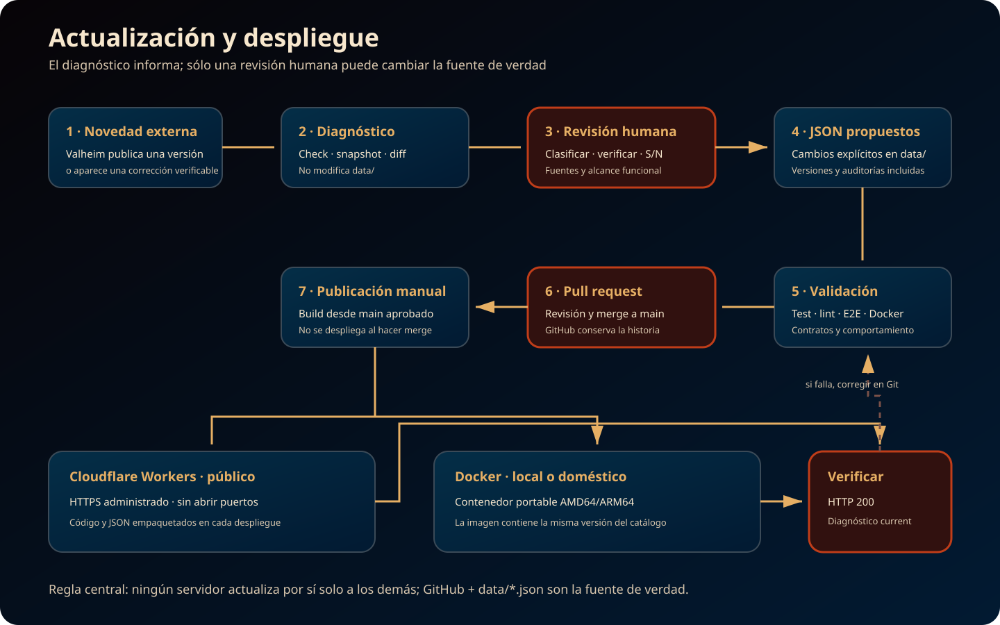
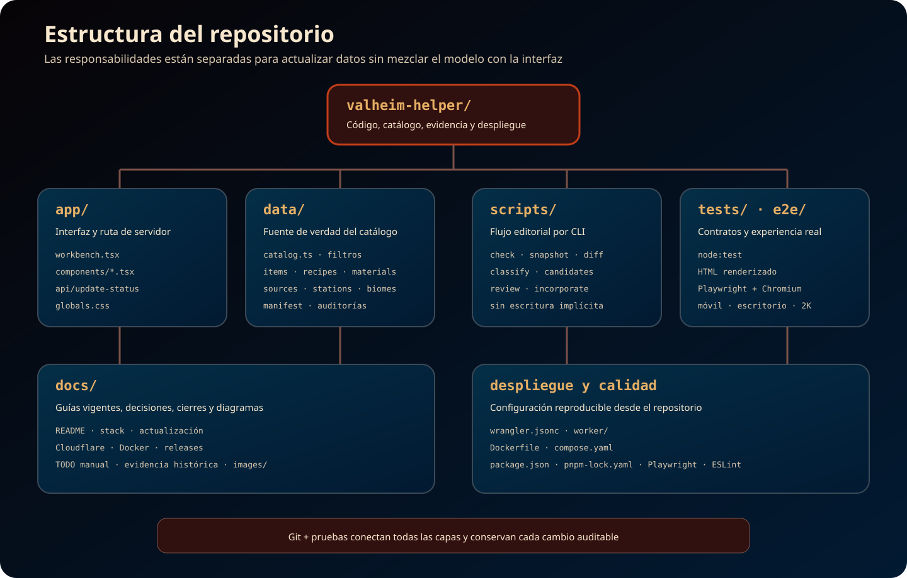

# Documentación del proyecto

Este índice separa la documentación vigente de las evidencias históricas. Para conocer el estado actual conviene comenzar por el README principal, el cierre `1.2.0` y el stack; los documentos de versiones anteriores no deben interpretarse como instrucciones operativas actuales.

## Vista general

- [`../README.md`](../README.md): propósito, funciones, ejecución y estado vigente.
- [`release-v1.2.0.md`](release-v1.2.0.md): alcance y validación de la versión activa.
- [`stack-tecnologico.md`](stack-tecnologico.md): tecnologías, responsabilidades, decisiones y límites.

## Operación y despliegue

- [`despliegue-cloudflare.md`](despliegue-cloudflare.md): publicación pública, autenticación, verificación, logs y rollback.
- [`despliegue-docker.md`](despliegue-docker.md): instalación doméstica en Linux, ARM64 y Windows/WSL 2.
- [`TODO-pruebas.md`](TODO-pruebas.md): controles manuales pendientes que no bloquean la versión.

## Datos y mantenimiento

- [`../data/README.md`](../data/README.md): contrato de los JSON y reglas de integridad.
- [`actualizacion-de-datos.md`](actualizacion-de-datos.md): procedimiento para detectar, revisar y publicar datos de una nueva versión de Valheim.
- [`roadmap-actualizacion.md`](roadmap-actualizacion.md): estado de los bloques del actualizador y pausa hasta Valheim `1.0`.
- [`../CHANGELOG.md`](../CHANGELOG.md): historial consolidado de cambios publicados.

## Evidencia histórica

Estos archivos justifican cierres y decisiones anteriores; sus conteos y estados corresponden a la fecha indicada en cada documento.

- [`release-v1.md`](release-v1.md): cierre de la primera versión estable.
- [`auditoria-consumibles-equipo-0.221.12.md`](auditoria-consumibles-equipo-0.221.12.md): evaluación editorial de candidatos funcionales.
- [`cierre-validaciones-0.1.25.md`](cierre-validaciones-0.1.25.md): reconciliación que cerró las diferencias conocidas del catálogo.

## Regla de mantenimiento

GitHub y los JSON versionados son la fuente de verdad. Cloudflare y Docker empaquetan una copia de esos archivos; ningún despliegue modifica el catálogo por sí solo. Todo cambio de datos debe pasar por revisión humana, pruebas, integración en `main` y una nueva publicación.
